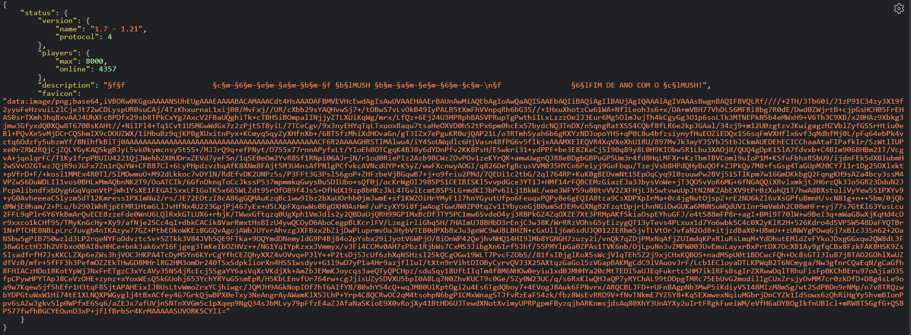

# Minecraft API

Este é um projeto de API que fornece informações sobre o status de servidores Minecraft. A API foi construída com Node.js e TypeScript e pode ser facilmente integrada a aplicações web para obter informações em tempo real sobre servidores Minecraft.

